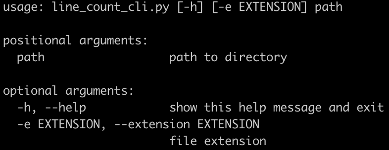

# Line Count For Target Directory

## Description
The program locates all files with the given extension in the given directory and all its subdirectories to produce a 
list of all matching files with the numbers of lines within the file. It also outputs the total number of lines and 
the average number of lines per file. An example of output would be


## Setup
The program uses python v3.8 and pylint from the PyCharm IDE plugin: https://plugins.jetbrains.com/plugin/11084-pylint/versions. 
Users are suggested to install/utilize Python 3.x for running the program.

## Usage
The program takes a directory as a required argument and a filename extension as optional argument that defaults to “.txt”. The directory can be either 

To check the command instruction, run
```bash
$ python line_count_cli.py -h
```
It would give following instruction:



An example of running the program:
```bash
$ python line_count_cli.py testing/testing_with_subdirectory -e .txt
```
You would expect the following results:


## Unit Tests
The unittest is under the folder `testing`. It contains two testing directories: `testing_with_subdirectory` and `testing_without_subdirectory`.

Command for running the test:
```bash
$ python -m unittest line_count_test.py
```
The results would be


## Common issues and solutions
- `ImportError: attempted relative import with no known parent package` or `ModuleNotFoundError: No module named 'line_count'`
  -  The error is caused as environment variable `PYTHONPATH` doesn't contain the project’s root directory. Solve it by running following command in terminal: 
    ```
    export PYTHONPATH="${PYTHONPATH}:/path/to/your/project/"
    ```

